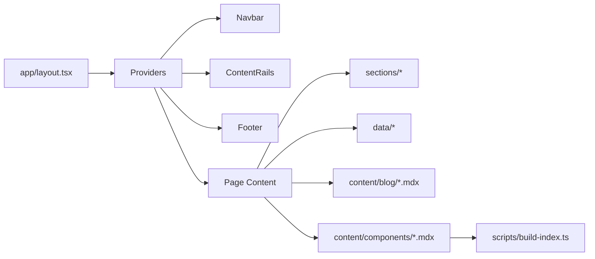

# Architecture

## Project Overview

This repository is a personal portfolio website built with Next.js 16 and TypeScript. It uses the Next App Router and Tailwind CSS v4 as the styling foundation. The site is content-driven with static data files, MDX-based blog posts, and a small component registry powered by file-system metadata.

Key architectural characteristics:

- `app/` based Next.js App Router
- Static content driven by `data/`, `content/`, and `config/site.ts`
- Server and client component split using `use client`
- Theme support via `next-themes` and custom theme presets
- Custom registry generator supporting lazy-loaded component demos
- SEO-first metadata, sitemap, robots, RSS, and OG image generation

## High-level Architecture

The application is organized around a root `app/layout.tsx` with shared providers and layout chrome:

- `ThemeProvider` (client)
- `ThemePresetProvider` (client)
- `TooltipProvider` (client)
- `Navbar`, `ContentRails`, `Footer`, `ScrollToTop`

Pages are rendered via App Router route files in `app/`. Data is primarily read synchronously from disk in server components using plain file system utilities and typed data exports.

### Architecture Diagram

## Folder Structure Explanation

- `app/` - Next.js App Router layout and route pages.
  - `app/page.tsx` - Home page.
  - `app/projects/page.tsx` - Projects listing.
  - `app/blog/page.tsx` - Blog index.
  - `app/blog/[slug]/page.tsx` - Blog post page.
  - `app/components/page.tsx` - Component registry index.
  - `app/components/[slug]/page.tsx` - Component detail page.
  - `app/robots.ts` - robots metadata route.
  - `app/sitemap.ts` - sitemap metadata route.
  - `app/blog/feed.xml/route.ts` - RSS feed route.
  - `app/api/npm-stats/route.ts` - API route for npm download stats.
  - `app/opengraph-image.tsx` and route-specific OG image generators.

- `components/` - React UI components.
  - `components/layout/` - Layout primitives and navigation.
  - `components/sections/` - Page sections used by home and route pages.
  - `components/ui/` - Styled shadcn/ui and Radix wrapper primitives.
  - `components/providers/` - application-level client providers.
  - `components/registry/` - registry preview and documentation UI.
  - `components/common/` - shared utility components like `RoleFlip`.

- `config/` - Global site configuration.
  - `config/site.ts` contains `siteConfig` and JSON-LD schema.

- `data/` - Typed static data used by pages and components.
  - `experience.ts`, `projects.ts`, `stack.ts`, `theme-presets.ts`, `social-links.ts`, `toc-items.ts`, `registry.ts`

- `content/` - Markdown/MDX content source.
  - `content/blog/*.mdx` for blog posts.
  - `content/components/*.mdx` for registry component metadata.

- `lib/` - Utility libraries and content parsers.
  - `lib/mdx.ts` - blog post loader and metadata parser.
  - `lib/components-content.ts` - component metadata and usage extraction.
  - `lib/utils.ts` - `cn` helper.
  - `lib/rehype-component.ts` - MDX rehype plugin for inline component previews.

- `registry/` - Component demo source and UI source templates.
  - `registry/examples/` - lazy-loaded demo entry points.
  - `registry/ui/` - optional UI source files associated with demos.

- `scripts/` - Build utilities.
  - `scripts/build-index.ts` generates `components/registry/index.tsx`.

- `public/` - Static assets and JSON files.

## Application Flow

1. User navigates to a route.
2. App Router resolves the page component in `app/`.
3. `app/layout.tsx` renders shared providers and layout chrome.
4. Page components read static data or MDX content from disk.
5. Interactive components mount on the client where `use client` is used.
6. Client state is restricted to link logic, theme toggles, mobile navigation, and small UI interactions.

## Routing Architecture

- Static top-level routes: `/`, `/projects`, `/blog`, `/components`, `/resume`, `/work`.
- Dynamic routes:
  - `/blog/[slug]` for blog posts.
  - `/components/[slug]` for registry component details.
- Metadata-only routes:
  - `/robots.txt` provided by `app/robots.ts`.
  - `/sitemap.xml` provided by `app/sitemap.ts`.
  - `/blog/feed.xml` via route handler.
- OG image routes:
  - `/opengraph-image` for the home page.
  - `/blog/opengraph-image` and `/blog/[slug]/opengraph-image`.
  - `/components/[slug]/opengraph-image`.
- API route:
  - `/api/npm-stats` returns download counts from npm.

## Component Architecture

The repository uses a clear separation between layout, sections, UI primitives, providers, and registry components.

### Layout Components

- `Navbar` is interactive and client-side.
- `ContentRails` is purely decorative and client-side.
- `Footer` includes theme dock and external links.
- `ScrollToTop` is client-only with Framer Motion.

### Page Sections

- `Hero`, `ExperienceSection`, `ProjectsSection`, `StackSection`, `GithubActivitySection`, `BlogSection`, `ContactSection`
- Each section is normally a client component when it uses motion or interactivity.

### UI Primitives

- `Button` uses `cva` and Radix `Slot`.
- `Tabs`, `Tooltip`, `HoverCard`, `Collapsible` wrap Radix primitives.
- `CopyButton`, `ThemeToggle`, `PreviewWrapper` provide reusable interactions.
- `cn()` is the shared classname helper using `clsx` and `tailwind-merge`.

## State Management Approach

- No global state library is present.
- Client state is localized using React hooks:
  - `useState` for menu toggle, theme mode, theme presets, copy state, mounted state, and active tab.
  - `useEffect` for hydration-related side effects, scroll listeners, and keyboard shortcuts.
- Persistent custom theme preset state is stored in `localStorage` via `ThemePresetProvider`.
- Page state is primarily server-rendered; client state is added only for UI interactions.

## Data Flow

- Static site data flows from `data/` and `config/site.ts` into server components.
- Blog content is loaded with `lib/mdx.ts` by reading `content/blog/*.mdx` and parsing frontmatter.
- Component registry metadata is loaded by `lib/components-content.ts` from `content/components/*.mdx`.
- `scripts/build-index.ts` scans registry example and UI directories to generate a lazy imports index.
- `getBlogPosts`, `getBlogPost`, `getRegistry`, and `getComponentContent` are the main server-side data entry points.

## Server vs Client Component Strategy

- Default components are server components.
- `use client` is added only in interactive or browser-dependent components.
- Examples of client components:
  - `components/layout/navbar.tsx`
  - `components/layout/content-rails.tsx`
  - `components/layout/scroll-to-top.tsx`
  - `components/providers/theme-provider.tsx`
  - `components/providers/theme-preset-provider.tsx`
  - `components/ui/` primitives that wrap Radix UI
  - `components/sections/hero.tsx`, `projects.tsx`, `blog.tsx`, `experience.tsx`, `stack.tsx`, `contact.tsx`
- Server components are used for route pages and content-heavy pages where no client-side interactivity is required, such as `app/page.tsx`, `app/blog/page.tsx`, and `app/components/page.tsx`.

## API Architecture

- `app/api/npm-stats/route.ts` is a route handler returning JSON.
- It validates the `pkg` query parameter and fetches npm download counts using the NPM downloads API.
- Caching is handled with `next: { revalidate: 3600 }` inside the fetch.

## Registry Architecture

The component registry is implemented as a file-system-driven content registry:

- `content/components/*.mdx` holds metadata for each registry component.
- `registry/examples/*.tsx` contains lazy-loaded demo implementations for previews.
- `registry/ui/*.tsx` contains optional source helper files.
- `scripts/build-index.ts` scans the registry directories and writes `components/registry/index.tsx`.
- `data/registry.ts` exposes `getRegistry()` and `getComponent()` wrappers.
- `app/components/[slug]/page.tsx` uses `getComponentContent()` and lazy/dynamic loading for heavy UI.
- `lib/rehype-component.ts` can embed demo source within MDX if called from content workflows.

## Build and Deployment Flow

### Build

- `npm install`
- `npm run build` → `next build`
- `npm run registry:index` can be used to regenerate the registry index before build.

### Deployment

- The repository targets Vercel.
- Root metadata, OG image endpoints, and static route handlers are compatible with Vercel's App Router deployment.
- No custom `next.config.ts` settings are currently defined.

## Dependency Analysis

### Core dependencies

- `next@16.2.9`
- `react@19.2.4`, `react-dom@19.2.4`
- `tailwindcss@4`
- `next-themes` for theme switching
- `@vercel/analytics`, `@vercel/og`, `@vercel/speed-insights`
- `shadcn` for UI scaffolding and Tailwind integration
- `framer-motion` for animation
- `gray-matter`, `reading-time`, `next-mdx-remote` for MDX content
- `class-variance-authority`, `clsx`, `tailwind-merge`
- `radix-ui` packages for accessible primitives
- `@tabler/icons-react` and `@iconify/react`

### Dev dependencies

- `eslint`, `eslint-config-next`, `prettier`, `husky`, `lint-staged`
- `typescript`, `@types/react`, `@types/node`
- `@tailwindcss/postcss`, `@tailwindcss/typography`
- `release-it`, `conventional-changelog-conventionalcommits`, `@commitlint/cli`

## Performance Optimizations Currently Implemented

- Dynamic import of heavy client-only components in `app/components/[slug]/page.tsx`:
  - `InstallTabs`
  - `ExpandableCode`
- Lazy-loaded registry demos via `components/registry/index.tsx`.
- `useReducedMotion()` gating for Framer Motion animations.
- `suppressHydrationWarning` in `<html>` and `<body>` to avoid mismatch warnings.
- `next-themes` hydration-safe theme handling.
- Minimal root layout markup.
- Client-side mounts gated with `useEffect` to avoid server mismatch and reduce initial JS.
- RSS route caching and npm API route caching.

## SEO Architecture

- Page metadata is centralized in `app/layout.tsx` and page-specific route files.
- `metadataBase`, title templates, Open Graph, Twitter card, and authors are defined.
- JSON-LD Person schema is injected in the root `<head>` via `config/site.ts`.
- Route metadata pages include `robots.ts`, `sitemap.ts`, and `feed.xml`.
- Dynamic OG images are generated by `@vercel/og` in `app/opengraph-image.tsx`, `app/blog/[slug]/opengraph-image.tsx`, and `app/components/[slug]/opengraph-image.tsx`.
- The blog index uses semantic headings and linkable article cards.

## Security Considerations

- External links use `rel="noopener noreferrer"` when opening in new tabs.
- `app/api/npm-stats/route.ts` validates query parameters and catches network errors.
- `ThemePresetProvider` uses `localStorage` only in client lifecycle methods.
- No server-side secrets or environment variables are present in repository code.
- The architecture avoids unsafe DOM operations in server components.

## Future Scaling Considerations

- Add new blog posts by dropping MDX into `content/blog/`.
- Add new registry components by creating `content/components/*.mdx` and `registry/examples/*-demo.tsx`.
- `scripts/build-index.ts` can be extended to include additional registry metadata.
- Adding routes should follow the App Router / `app/` conventions with metadata and consistent layout.
- Avoid large client-side state libraries; keep the site lightweight and static-first.
- Additional analytics or runtime features should be introduced as separate client components or edge routes.
